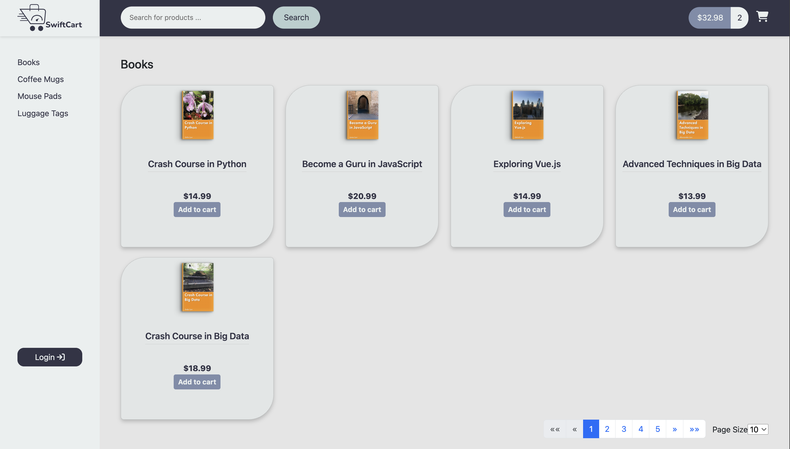
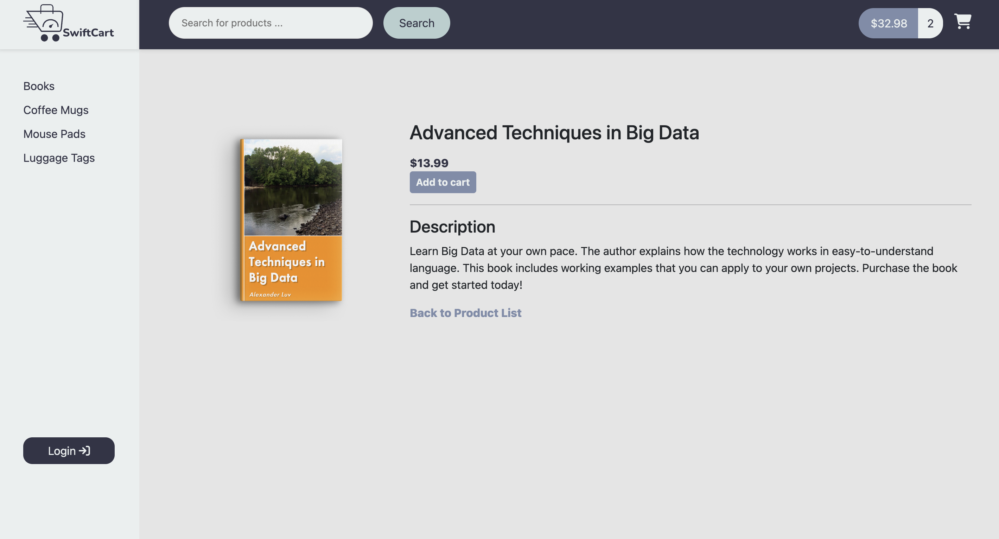
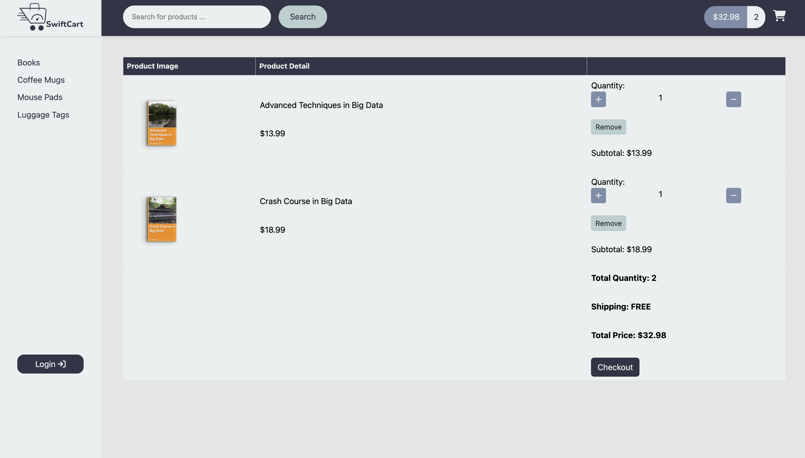
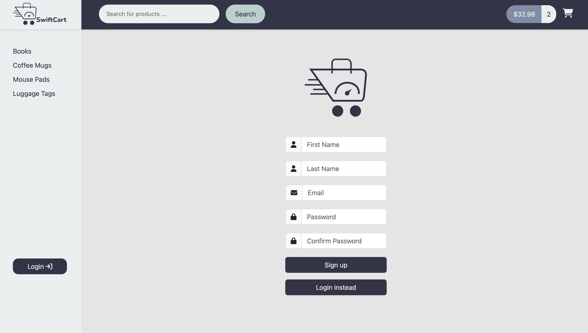
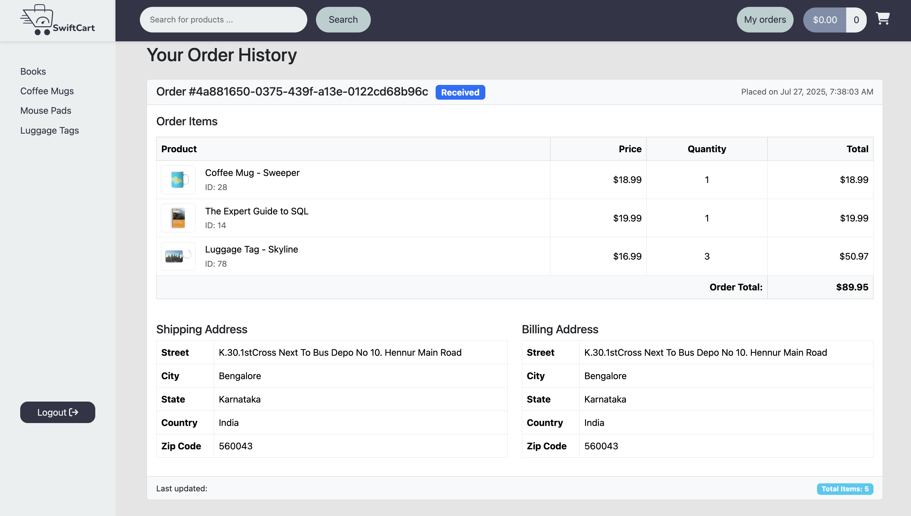

# 🛍️ SwiftCart

**SwiftCart** is a full-stack eCommerce web application built using **Angular** for the frontend and **Spring Boot** for the backend. It supports full CRUD operations, secure authentication, and essential eCommerce features for a smooth user experience.

## 🚀 Tech Stack

- **Frontend:** Angular  
- **Backend:** Spring Boot  
- **Authentication:** JWT (Login & Signup)  
- **Database:** (MySQL)

## ✅ Features

- 🛒 **Product Listing & Details**  
  - View a list of products with detailed info for each item.

- 🗂️ **Category Grouping**  
  - Products are grouped by their categories.

- 🔍 **Search Functionality**  
  - Search for products by name.

- 📄 **Pagination**  
  - Paginated product list for better performance.

- ➕ **Add to Cart**  
  - Add products to your shopping cart.

- 🔐 **Authentication**  
  - Login and Sign Up for users with secure access.

- 🧾 **Checkout Page**  
  - Authenticated users can submit checkout information.

- 📦 **Order History**  
  - View personal order history and track order status.

## 📸 Screenshots

### 🏠 Home Page

### 📄 Product Details Page

### 📄 Cart Page

### 📄 Authentication Page

### 📄 Order History Page

## 🔗 Live Demo

🚀 [Click here to view SwiftCart in action](https://ecommerce-swift-cart-frontend.onrender.com)

## 📂 Repository

📁 [GitHub Backend Repo](https://github.com/nakqeeb/ecommerce-swift-cart-backend)
